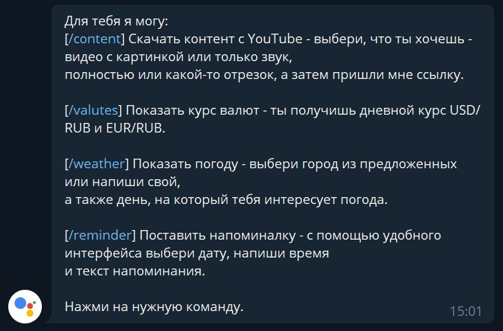
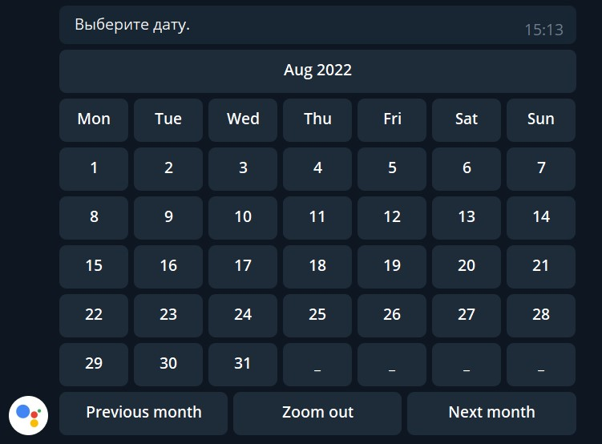
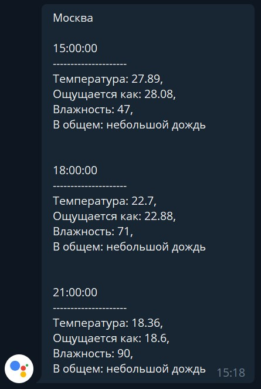
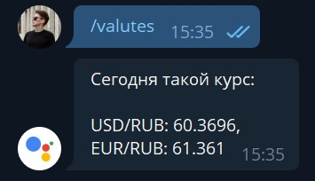

# MyAssistant

Personal assistant-bot in Telegram with the following functionality:
- downloading content from YouTube
- showing exchange rates
- showing weather forecasts
- setting reminders

# Installation and setup

Note: To setup this project you have to have ```pip``` installed.

At first, clone project to your local machine:

```git clone https://github.com/robz-tirtlib/myassistant.git```

cd into project folder:

```cd myassistant```

Create and activate virtual environment:

```
python3 -m venv .venv
. .venv/bin/activate
```

Install dependencies using requirements.txt:

```pip install -r requirements.txt```

Run main.py:

```python3 main.py```

# Project showcase

To get a brief overview of available commands send ```/help```.

<!--  -->


---

- Set reminders using calendar interface, sending timestamp and reminder text



- Choose your city and weather mode via buttons and recieve a forecast




- Get today's exchange rates via ```/valutes```



- Choose content mode (full/part) and type (video/audio) using buttons and get your content from YouTube


- Cancel current state via ```/cancel``` command if you feel like you've done something wrong

# Reflection

Building this project I got familiar with bots creation on Python via pyTelegramBotAPI library, operating SQLite database, using git, APIs and deploying to a remote Linux server.
